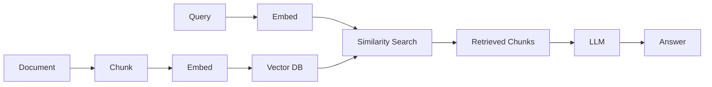
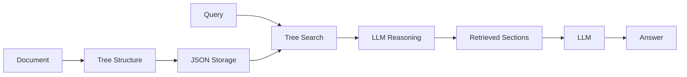

PageIndex is a **vectorless** system - it achieves state-of-the-art RAG performance without using vector databases, embeddings, or semantic similarity search. This architectural choice fundamentally changes how document retrieval works.

## What Does "Vectorless" Mean?

Traditional RAG systems require several vector-based components:

<CardGroup cols={2}>
  <Card title="Embedding Model" icon="layer-group">
    Converts text chunks into high-dimensional vectors
  </Card>
  <Card title="Vector Database" icon="database">
    Stores and indexes embeddings for similarity search
  </Card>
  <Card title="Similarity Search" icon="arrows-to-dot">
    Computes distance metrics between query and document vectors
  </Card>
  <Card title="Chunk Management" icon="scissors">
    Handles splitting, overlapping, and metadata for chunks
  </Card>
</CardGroup>

**PageIndex eliminates all of these.** Instead, it uses document structure and LLM reasoning.

## How PageIndex Works Without Vectors

PageIndex replaces the entire vector-based pipeline with two core components:

### 1. Hierarchical Tree Index

Instead of embedding chunks, PageIndex creates a semantic tree structure:

```json
{
  "title": "Financial Stability",
  "start_index": 21,
  "end_index": 31,
  "node_id": "0006",
  "nodes": [
    {
      "title": "Monitoring Financial Vulnerabilities",
      "start_index": 22,
      "end_index": 28,
      "node_id": "0007"
    }
  ]
}
```

This tree is **stored as plain JSON** - no vector database needed.

### 2. LLM Reasoning for Retrieval

Instead of similarity search, PageIndex uses the LLM to **reason** about which nodes are relevant:

```
Query: "What financial vulnerabilities were monitored?"

LLM Reasoning:
- Scan root nodes for relevant sections
- "Financial Stability" is directly related to the query
- Examine child nodes under "Financial Stability"
- "Monitoring Financial Vulnerabilities" matches the query intent
- Retrieve pages 22-28
```

<Note>
The LLM reads the tree structure (titles, summaries, page ranges) and makes intelligent decisions about where to look - no vector math required.
</Note>

## Why Go Vectorless?

### 1. Better Accuracy

PageIndex achieves **98.7% accuracy** on FinanceBench without vectors. Why?

**Vectors lose information**: Compressing text into fixed-dimensional embeddings loses nuance, structure, and context.

**Reasoning preserves understanding**: LLMs can fully comprehend section titles, hierarchical relationships, and semantic meaning.

<Info>
**Example**: A section titled "Regulatory Developments" has clear semantic meaning that's preserved in text but compressed away in a 1536-dimensional embedding.
</Info>

### 2. True Explainability

Vector similarity is fundamentally opaque:

```
Vector RAG: "Retrieved chunk 47 (cosine similarity: 0.83)"
❌ Why? What made this relevant? Unknown.
```

PageIndex reasoning is transparent:

```
PageIndex: "Retrieved 'Monitoring Financial Vulnerabilities' (pages 22-28)"
✅ Why? The query asks about vulnerabilities, and this section's title 
   directly indicates it discusses monitoring them.
```

### 3. No Infrastructure Overhead

Vector RAG requires significant infrastructure:

- **Vector databases**: Pinecone, Weaviate, Qdrant, Milvus
- **Embedding APIs**: OpenAI, Cohere, or self-hosted models
- **Index management**: Building, updating, and maintaining vector indices
- **Dimension tuning**: Choosing embedding dimensions and distance metrics

PageIndex requires:

- **JSON storage**: Any file system or database
- **LLM API**: For generation and reasoning (already needed for RAG)

<Tip>
Simplifying your stack reduces maintenance burden, costs, and potential failure points.
</Tip>

### 4. No Chunking Problems

Vector RAG must split documents into chunks for embedding:

```python
# Traditional RAG: Arbitrary chunking
chunks = split_text(
    text, 
    chunk_size=1000,  # Arbitrary token limit
    overlap=200        # Overlap to preserve context
)
```

Problems with chunking:
- **Lost boundaries**: Important sections split mid-thought
- **Lost hierarchy**: Parent-child relationships destroyed  
- **Lost context**: Chunks don't know their position in the document
- **Parameter sensitivity**: Results vary wildly with chunk size

PageIndex uses natural document sections:

```json
{
  "title": "Entertainment Segment Results",
  "start_index": 1,
  "end_index": 2
}
```

Benefits:
- **Natural boundaries**: Follows document structure
- **Preserved hierarchy**: Parent-child relationships maintained
- **Full context**: Exact page ranges and position
- **No parameters**: Structure is inherent to the document

<Warning>
Chunking is one of the most challenging aspects of traditional RAG. Different chunk sizes work better for different queries, making it nearly impossible to optimize.
</Warning>

### 5. Dynamic Context Windows

Vector RAG is limited by fixed chunk sizes:

```
Chunk size: 1000 tokens
↓
Always retrieve ~1000 tokens per chunk
even if you need more or less context
```

PageIndex adapts to natural section sizes:

```json
[
  {"title": "Overview", "start_index": 7, "end_index": 8},
  {"title": "Supervisory Developments", "start_index": 35, "end_index": 54}
]
```

The first section is 1-2 pages, the second is 19 pages. **PageIndex retrieves the right amount of context based on document structure, not arbitrary limits.**

## Technical Architecture Comparison

### Traditional Vector RAG Pipeline



### PageIndex Vectorless Pipeline



<Note>
Notice how PageIndex eliminates the embedding and vector search steps entirely, simplifying the architecture while improving performance.
</Note>

## What About Scalability?

**Common question**: "Don't vector databases scale better than reading JSON trees?"

**Answer**: PageIndex scales differently, but effectively:

### Vector DB Scaling

- **Millions of documents**: Vector DBs excel at searching millions of embeddings
- **Per-document cost**: Constant time lookup (O(log n) or better with indexing)
- **Use case**: Finding similar documents across a large corpus

### PageIndex Scaling  

- **Single document depth**: PageIndex excels at deep understanding of individual documents
- **Per-document cost**: Proportional to tree depth (typically O(log n) nodes)
- **Use case**: Extracting precise information from long, complex documents

<Info>
**Real-world reality**: Most enterprise RAG applications deal with 10-10,000 documents, not millions. At this scale, PageIndex's JSON-based approach is more than sufficient and far simpler to maintain.
</Info>

## When Vectors Are Still Useful

The vectorless approach is optimal for:

✅ **Long, structured documents** (reports, manuals, textbooks)
✅ **Professional/technical documents** requiring precision
✅ **Scenarios requiring explainability**
✅ **Complex, multi-step queries**

Vectors may still be better for:

- **Semantic search** over large, unstructured text corpora
- **Finding similar documents** across millions of items
- **Fuzzy matching** where approximate results are acceptable
- **Simple Q&A** over homogeneous content

<Tip>
You can even combine approaches: Use PageIndex for structured documents in your corpus and vector search for unstructured notes or comments.
</Tip>

## The AlphaGo Inspiration

PageIndex draws inspiration from AlphaGo's success in mastering Go:

**AlphaGo**: Used tree search (MCTS) + neural networks to evaluate board positions

**PageIndex**: Uses tree search + LLM reasoning to evaluate document sections

Both demonstrate that **search + reasoning** can outperform pure similarity-based approaches.

## Cost Implications

Removing vectors affects costs in several ways:

### Eliminated Costs
- ❌ Vector database hosting/licensing
- ❌ Embedding API calls (millions of chunks)
- ❌ Index maintenance and updates

### New Costs  
- ✅ Tree structure generation (one-time per document)
- ✅ LLM reasoning during retrieval (typically 2-5 tree search steps)

<Info>
For most use cases, especially with long documents that would generate thousands of chunks, the vectorless approach is **significantly more cost-effective**.
</Info>

## Getting Started Without Vectors

Try PageIndex's vectorless RAG approach:

<CodeGroup>

```python Open Source
from pageindex import page_index

# Generate tree structure (no vectors needed)
result = page_index(
    doc="financial_report.pdf",
    model="gpt-4o",
    if_add_node_summary="yes"
)

# Tree is stored as JSON
with open("tree.json", "w") as f:
    json.dump(result, f)
```

```python API
import requests

# Generate tree via API
response = requests.post(
    "https://api.pageindex.ai/v1/index",
    headers={"Authorization": f"Bearer {API_KEY}"},
    files={"file": open("report.pdf", "rb")}
)

tree = response.json()
```

</CodeGroup>

## Next Steps

<CardGroup cols={2}>
  <Card title="Tree Structure" icon="sitemap" href="/concepts/tree-structure">
    Deep dive into PageIndex's hierarchical tree format
  </Card>
  <Card title="Vectorless RAG Tutorial" icon="flask" href="/cookbook/vectorless-rag-pageindex">
    Build a complete RAG system without vectors
  </Card>
  <Card title="API Quickstart" icon="bolt" href="/quickstart">
    Start generating tree structures via API
  </Card>
  <Card title="Vision RAG" icon="eye" href="/cookbook/vision-rag-pageindex">
    OCR-free, vectorless RAG with page images
  </Card>
</CardGroup>